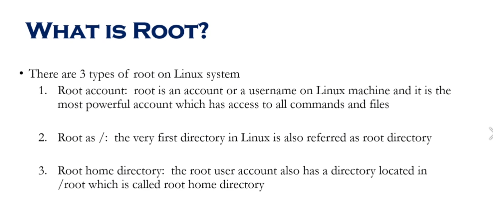
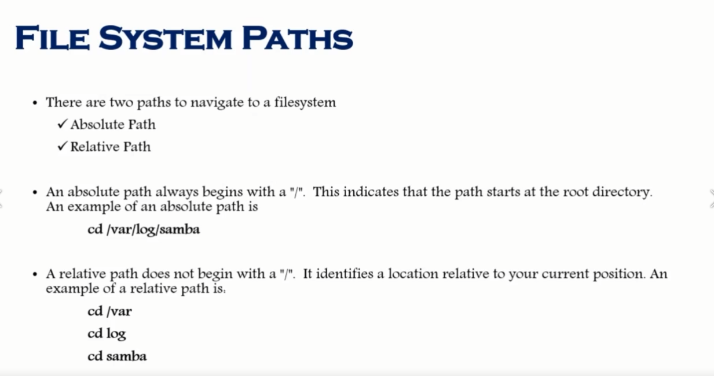
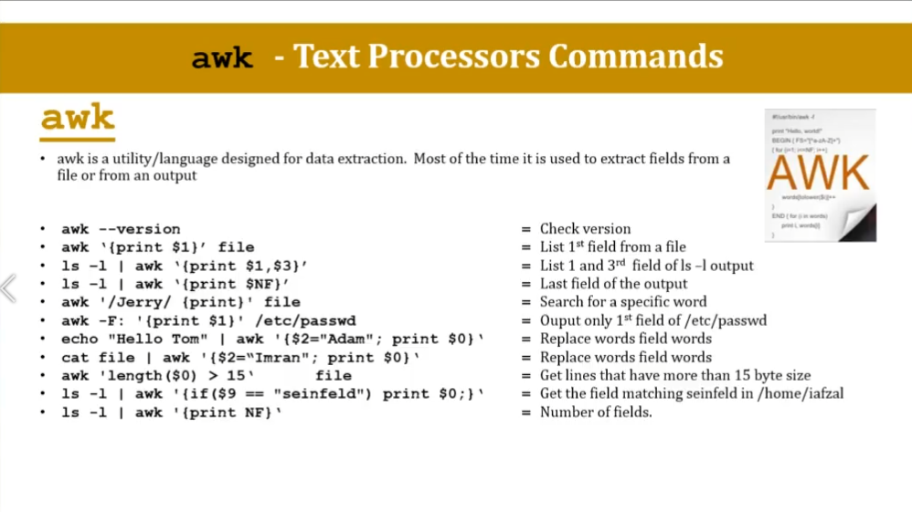

# System Access and File system

## Command Prompt

## Access To Linux System

**Access To Linux From Mac**

## New Network Command (IP)

`ip a`

`ip addr`

`ifup <internet driver name>` `reboot`

## Linux File System 

## Navigating File System

## What is Root ?

## File System Paths

## Directory Listing Attributes

## Creating Files And Directories

## Copy Directories

1. `cp -R <source_folder> <destination_folder>`

## linux File types

## Find Files And Directories

**two main commands are used to find files/directories**
1. `find`

2. `find . -name "pedram.txt"`

3. `locate`

4. `locate "pedram.txt" ` before `yum install mlocate` and `updatedb`

## Difference Between find and locate

## Changing Password

1. `passwd <userId>`

## WildCards

1. `touch abcd{1..9}.txt` create 9 files

2. `rm abcd*`

3. `ls -l abcd*`

4. `rm *.xyz`

5. `ls -l ?bcd*`

6. `ls -l *[cd]*`

## Soft and Hard Links
**Link is just a shortcut**

**yu cannot create soft or hard link within the same directory with the same name.**

**hard links only work within the same partition**

`ls -ltrhi` i = inode

--------------------------

# Fundamentals

## Linux Command Syntax

1. `ls -l` -l is **options**

2. `ls -l Downloads` Downloads is **argument**

## File Permissions

1. **user**`chmod u+rwx <fileName>` 

2. **group**`chmod g+rwx <fileName>` 

3. **others**`chmod o-rwx <fileName>` 

4. **everyone**`chmod a-rwx <fileName>` 

**if a directory does not have execute permission (x) you can not cd to the directory**

## Permission using numeric mode

## File Ownership

1. `chown <username> <fileName>`

2. `chgrp  <username> <fileName>`

## Access Control List (ACL)

## Help Commands
1. `whatis command`

2. `command --help`

3. `man command`

## Adding Text to Files (Redirects)

1. `echo "some text" [>> , >] file.txt`

2. `ls -ltrh > file.txt`

## Input and Output Redirects

## Standard Output to a file (tee)

1. `echo "pedram aghasian is the best" | tee file.txt` 

2. `echo "also is network specialist" | tee -a file.txt`

3. `echo "also is network specialist" | tee file1 file2 file3`

## Pipes 

1. `ls -ltrh | more`

2. `ls -ltrh | tail -1`

## File Maintenance Commands

1. `cp file.txt newFile.txt ` create newFile.txt and copy file.txt ino it.
2. `cp file.txt /tmp`
3. `mv file.txt newName.txt` rename a file.
4. `mv file.txt /tmp` cut file.
5. `chgrp root file.txt`
6. `chgown root file.txt`
7. `chown root:root file.txt`

## File Display Commands

## Filters / Text Processors Commands

1. ### cut

2. ### awk

3. ### grep/egrep

4. ### sort/uniq
5-17
