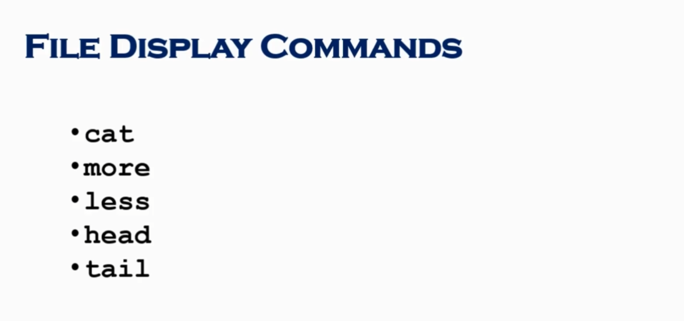
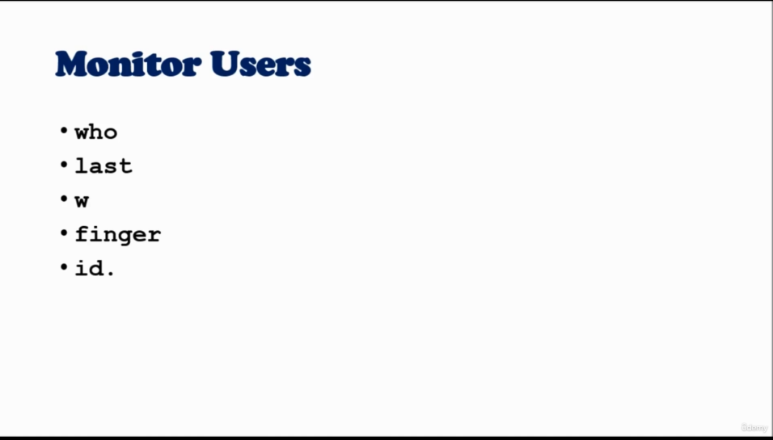
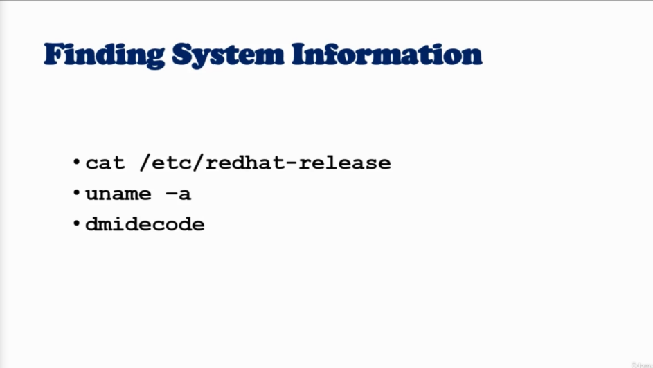
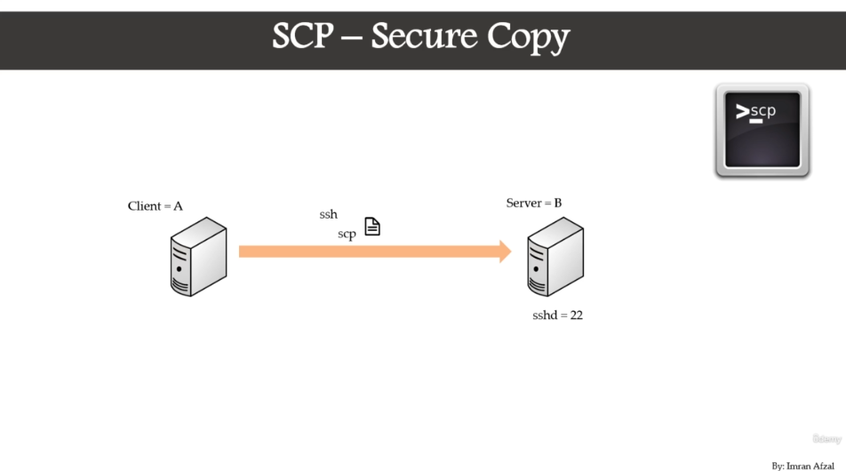

# Module-1 : Understanding Linux Concepts

# Module-2 : Download and install
# Module-3 : System Access and File system

## Command Prompt


## Access To Linux System


**Access To Linux From Mac**


## New Network Command (IP)


`ip a`

`ip addr`

`ifup <internet driver name>` `reboot`

## Linux File System 


## Navigating File System


## What is Root ?


## File System Paths


## Directory Listing Attributes


## Creating Files And Directories


## Copy Directories

1. `cp -R <source_folder> <destination_folder>`

## linux File types


## Find Files And Directories

**two main commands are used to find files/directories**
1. `find`

2. `find . -name "pedram.txt"`

3. `locate`

4. `locate "pedram.txt" ` before `yum install mlocate` and `updatedb`


## Difference Between find and locate


## Changing Password

1. `passwd <userId>`

## WildCards

1. `touch abcd{1..9}.txt` create 9 files

2. `rm abcd*`

3. `ls -l abcd*`

4. `rm *.xyz`

5. `ls -l ?bcd*`

6. `ls -l *[cd]*`

## Soft and Hard Links
**Link is just a shortcut**


**yu cannot create soft or hard link within the same directory with the same name.**

**hard links only work within the same partition**

`ls -ltrhi` i = inode


------------------------------
# Module-4 : Fundamentals

## Linux Command Syntax


1. `ls -l` -l is **options**

2. `ls -l Downloads` Downloads is **argument**

## File Permissions

1. **user**`chmod u+rwx <fileName>` 

2. **group**`chmod g+rwx <fileName>` 

3. **others**`chmod o-rwx <fileName>` 

4. **everyone**`chmod a-rwx <fileName>` 

**if a directory does not have execute permission (x) you can not cd to the directory**

## Permission using numeric mode


## File Ownership


1. `chown <username> <fileName>`

2. `chgrp  <username> <fileName>`

## Access Control List (ACL)


## Help Commands
1. `whatis command`

2. `command --help`

3. `man command`

## Adding Text to Files (Redirects)


1. `echo "some text" [>> , >] file.txt`

2. `ls -ltrh > file.txt`


## Input and Output Redirects


## Standard Output to a file (tee)


1. `echo "pedram aghasian is the best" | tee file.txt` 

2. `echo "also is network specialist" | tee -a file.txt`

3. `echo "also is network specialist" | tee file1 file2 file3`

## Pipes 


1. `ls -ltrh | more`

2. `ls -ltrh | tail -1`

## File Maintenance Commands


1. `cp file.txt newFile.txt ` create newFile.txt and copy file.txt ino it.
2. `cp file.txt /tmp`
3. `mv file.txt newName.txt` rename a file.
4. `mv file.txt /tmp` cut file.
5. `chgrp root file.txt`
6. `chgown root file.txt`
7. `chown root:root file.txt`

## File Display Commands



## Filters / Text Processors Commands


1. ### cut


2. ### awk


3. ### grep/egrep


4. ### sort/uniq


5. ### wc


## Compare Files (diff and cmp)


## Compress and unCompress (tar, gzip, gunzip)

**tar :** tar takes a bunch of files together and put it in one container, just like in windows you have bunch of files and zip them together, so tar file does not compress as much as the actual **gzip** command.

1. `tar cvf <fileName>.tar <path>`
2. extract tar file : `tar xvf file.tar`

**gzip :** is actually compress files

3. compress tar file : `gzip file.tar`
4. upCompress file : `gunzip file.tar.gz` or `gzip -d file.tar.gz`

## Truncate File Size


 shrink or extend a file : `truncate -s <size bit> filename`

 ## Combining and splitting files


## Linux vs. Windows Commands


----------------------------------------

# Module-5 : Linux System Administration

## Linux File Editor


**vi Editor**


**Exit from Vi** `shift + z + z`

**Undo** `u`

## Difference Between vi and vim Editor


## sed Command


1. **replace a word and just show the result**`sed 's/oedram/pedram/g' <fileName>`

2. **replace a word and write to that file**`sed -i 's/oedram/pedram/g' <fileName>`

3. **delete a word**`sed 's/pedram//g' <fileName>`

4. **delete all the line which have specific word** `sed '/pedram/d' <fileName>`

5. **remove empty lines from a file** `sed '/^$/d' <fileName>`

6. **remove first line of the file** `sed '1d' <fileName>`

7. **remove first two line of the file** `sed '1,2d' <fileName>`

8. **replace tabs with space** `sed 's/\t/ /g' <fileName>`

9.  **just show line 12 be bad** `sed -n 12,18p <fileName>`

10. **make empty line after every line** `sed G <fileName>`
    
11. **replace every word except word in line number 8** `sed '8!s/oedram/pedram/g' <fileName>`
    
12. **in vim editor** `:%s/oedram/pedram/g`

## User Account Management (useradd, groupadd, usermod, userdel, groupdel)


**create user**
1. **create user** `useradd spiderman`
2. **get use id**  `id spiderman`
3. **assign a password** `passwd 123456`

**modify user**
1. **modify a user account** `usermod -G <groupName> <userName>`

**delete user**
1. **delete a use with homeDir** `userdel -r spiderman`
2. **show all groups** `cat /etc/groups` or `grep spederman /etc/group`

**create group**
1. **create a group** `groupadd superheros`
2. **show all groups** `cat /etc/groups`

**delete group**
1. **delete a group** `groupdel superheros`
 
 **cat /etc/passwd**

 **username: password : userId : groupId : description : homeDir : shell**

 **cat /etc/group**

 **groupName: groupPassword: groupId : users are part of this group**

**cat /etc/shadow**
 
**show information about users passwords**

## Password Aging


## Switch Users and sudo Access


**grant root access to the user**

- `/etc/sudoers` : and add the user

```text
root ALL=(ALL)    ALL
pedram ALL=(ALL)    ALL
```

- or add the user to the sudoers group

`usermod -aG wheel pedram`

- then with your username you can run sudoers command : ` sudo pedram`

## Monitor Users



1. `who` : information about how many people are logged in; when there is height load an the system and you want to see who are logged to the system.
2. `last`: tell you all the details are the users that logged in.
- `last | awk '{print $1}' | sort | uniq`
3. `w` : give you little more information.
4. `finger`
5. `id` or `id username` : get information about yourself.

## Talking To Users


1. `wall` + message + (ctrl + d) : broadcast a message to all users who loggedIn.
2. `write username` : send message directly to the user.

## Linux Directory Service - Account Authentication

**LDAP is a Protocol NOT Directory service**


## Difference between AD,LDAP,IDM,WinBIND,OpenLDAP


## System Utility Commands


**uptime** 


**which**

`which <command>`  tell you about command

**bc**

`bc` command line calculator

## Processes and Jobs


**Application or service**

it's like a program that's run into your computer, for example NTP - NFS - rsyslog - Apache.

In Windows, daemons are called services, and behave exactly how daemons were previously described.
They exist and operate independent of a user’s login session, and its status can be observed under the Services tab of Windows Task Manager.

**Script**

script is something that written in a file, and they can be execute.

**Process**

when you run an application it actually generate process with process id.

An instance of a particular executable that is being executed:
For example this could be an .exe program file or a Linux binary. A given application may have several processes running simultaneously.

Typically, an executing program can exist in one of three states:
Running: Active
Sleeping: Inactive
Zombie: A process that has completed execution, but still has an entry in the process table

**Daemon**

is constituently runs in the background.

A process which runs in the background and is not interactive.
They have no controlling terminal on their own from the user’s perspective from the desktop.
They continue to exist and operate regardless of any user being logged into the server if the computer is on.

**Threads**

every process could have multiple threads.

**Job**

a job is something that is created by scheduler like a workorder to run those application and services.


## ps command


## top command


## kill command


## Crontab Command


## at command


## Additional Cron Jobs


## Process Management


## System Monitoring


`netstat -rnv`

## Log Monitoring


## System Maintenance Commands 


## changing System Hostname


## finding System Information



`cat /etc/os-release`

## System Architecture


## Terminal Control Keys


## Terminal Commands 


watch and save all terminal activity `script activity.lgo`

for exit of `exit`

## Recover Root Password


## SOS Report


## Environment Variables


## Special Permissions with setuid, setgid and sticky bit


1. `which passwd`
2. `ls - l /usr/bin/passwd`
3. with user pedram run`passwd`
4. go to another terminal and `ps -ef | grep passwd`
5. you see this command run by root


-------------------------------------------------

# Module-6 : Shell Scripting

## Linux Kernel


## Introduction to Shell


## Types of Linux shells


## Shell Scripting


## Basic scripts

```bash
#!/bin/bash

# commands 
pwd
echo
hostname
echo
ls -ltrh

# define variables
fullName = 'pedram aghasian'
echo my name is $fullName
```
## Input/Output of Script


```bash
#!/bin/bash

a = `hostname`
echo Hell, my hostname is $a
echo
echo What is your name ?
read NAME
echo
echo Hello $NAME
echo
```

## if-then Scripts


```bash
#!/bin/bash

count = 100
if [ $count -eq 100 ]
then
    echo Count is 100
else
    echo Count is not 100
fi
```

```bash
#!/bin/bash

clear
if [ -e /home/pedram/secrete.txt ]
then
    echo "file secrete.txt is exist"
else
    echo "secrete.txt is not exits"
fi
```
## For Loop Scripts


```bash
#!/bin/bash

for i in 1 2 3 4 5
do
    echo $i
done
```

## do-while Scripts


```bash
#!/bin/bash

c = 1
while [ $c -le 5]
do
    echo welcome $c 
    ((c++))
done
```

## Case Statement Scripts


## check other servers connectivity


## Aliases


`alias` show all aliases

`unalias <aliasName>` delete an alias

## Shell History

1. show history `history`
2. run commands witch in history  `!<command number> !405`
3. history location `cat /home/pedram/.bash_history`

---------------------------------------------

# Module-7 : Networking, Services, System Updates

## Network Components


## Network files and Commands


 
 `netstat -rnv`

 `tcpdump -i <interface>`

 ## NIC Information


## NIC Bonding


## New Network Utilities


## Download Files or Apps


 
## curl and ping commands


what if server is up but page is down ?? in this case you should use `curl` command.

you can use `curl -O <url>` instead of `wget` for downloading.

## FTP - File Transfer Protocol


 
 **Configure FTP**


**on Ubuntu**

1. `sudo apt install vsftpd`
2.  `apt list | grep vsftpd`
3.  `sudo service vsftpd status`
4.  `cp /etc/vsftpd.conf /etc/vsrftpd.conf.orig`
5.  `sudo nano /etc/vsftpd.conf`
6.  
```text
listen=NO
 listen ipv6=YES 
anonymous_enable=NO
 local_enable=YES 
write_enable=YES
 local_umask=022
 dirmessage_enable=YES 
use_localtime=YES xferlog_enable=YES
 connect_from_port_20=YES
 chroot_local_user=YES 
secure_chroot_dir=/var/run/vsftpd/empty 
pam_service_name=vsftpd 
rsa_cert_file=/etc/ssl/certs/ssl-cert-snakeoil.pem
 rsa_private_key_file=/etc/ssl/private/ssl-cert-snakeoil.key
 ssl_enable=NO  
pasv_enable=Yes 
pasv_min_port=10000 
pasv_max_port=10100 
allow_writeable_chroot=YES
```
7. `systemctl enable vsftpd`

**FTP Client Configure**


**if see this error follow as blew**

500 Illegal PORT command.

go to passive mode in ftp> `pass`

## SCP - Secure Copy Protocol

**SCP use SSH protocol**




**configure SCP**


## rsync - Remote Synchronization

**rsync use SSH protocol**


**configure rsync**


## System Updates and Repository


## System Upgrade/Patch Management


## Create Local Repository from cd/dvd


1. make a directory
2. copy all your content to that directory
3. go to your local repo directory and run `dpkg-scanpackages . /dev/null > Release`
4. give you current directory size `du -sh .`
5. give you system space `df -h`
9. `vim /etc/apt/source.list`
10. add the blew line to that file
```text 
 deb [trusted=yes] file:///opt/debs ./
 ```

 ## Advance Package Management


`dpkg` and `apt` are both package management tools for Ubuntu and other Debian-based Linux distributions.

`dpkg` (Debian Package Manager) is the low-level tool for installing, removing, and managing Debian packages. It is used to install, remove and manage Debian packages. It works on the package files themselves, and does not have the advanced dependency resolution capabilities of apt.

`apt` (Advanced Packaging Tool) is a higher-level tool that is built on top of `dpkg`. It provides a more user-friendly interface for managing packages, and also includes advanced features such as dependency resolution, package searching, and automatic updates. It is the recommended tool for managing packages on Ubuntu and other Debian-based Linux distributions.

In short, `dpkg` is the underlying package management system for Ubuntu and apt is a user-friendly front-end for managing packages on Ubuntu.


1. **check if a package is installed** 

`dpkg -l | grep package-name`

`apt list --installed package-name` 

2. **remove package**

`sudo apt remove package-name`

`sudo apt autoremove`

`sudo dpkg -r package-name` for deleting packages which installed with `dpkg -i`

3. **check dependency of a package**

`apt-cache showpkg package-name`

`apt show package-name`

4. **install package**

`sudo apt install package-name`

`sudo dpkg -i package-name.deb`

install dependency with this `sudo apt-get install -f` command and then run `sudo dpkg -i .deb`

5. **show configuration of package which installed**

`dpkg -L package-name`

`dpkg-query -L package-name`

`sudo find / -user root -group root -name "*package-name*"`

6. **which package this command belongs to**

`dpkg -S /usr/bin/pwd`

7. **search about a package on the repository**

`apt-cache search package-name`

`apt-cache policy package-name`


## Rollback Updates and Patches


In short, apt update updates the package list, apt upgrade upgrades the packages.
It is a good practice to run apt update regularly to keep your package list up to date and apt upgrade periodically to keep your system up to date.

`sudo apt-get install example=1.0`

**show apt history**

`apt history`

`cat /var/log/apt/history.log`


7-18