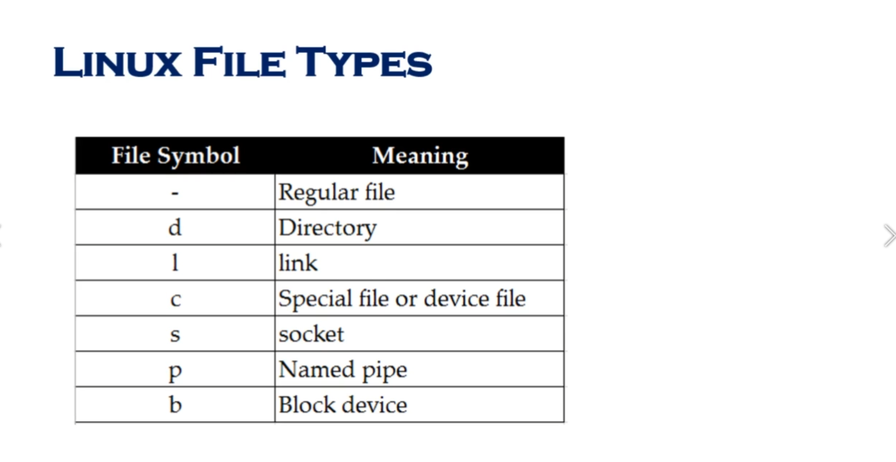

# System Access and File system

## Command Prompt


## Access To Linux System


**Access To Linux From Mac**


## New Network Command (IP)


`ip a`

`ip addr`

`ifup <internet driver name>` `reboot`

## Linux File System 


## Navigating File System


## What is Root ?


## File System Paths


## Directory Listing Attributes


## Creating Files And Directories


## Copy Directories

1. `cp -R <source_folder> <destination_folder>`

## linux File types


## Find Files And Directories

**two main commands are used to find files/directories**
1. `find`

2. `find . -name "pedram.txt"`

3. `locate`

4. `locate "pedram.txt" ` before `yum install mlocate` and `updatedb`


## Difference Between find and locate


## Changing Password

1. `passwd <userId>`

## WildCards

1. `touch abcd{1..9}.txt` create 9 files

2. `rm abcd*`

3. `ls -l abcd*`

4. `rm *.xyz`

5. `ls -l ?bcd*`

6. `ls -l *[cd]*`

## Soft and Hard Links
**Link is just a shortcut**


**yu cannot create soft or hard link within the same directory with the same name.**

**hard links only work within the same partition**

`ls -ltrhi` i = inode


# Linux System Administration-----------

# Fundamentals

## Linux Command Syntax


1. `ls -l` -l is **options**

2. `ls -l Downloads` Downloads is **argument**

## File Permissions

1. **user**`chmod u+rwx <fileName>` 

2. **group**`chmod g+rwx <fileName>` 

3. **others**`chmod o-rwx <fileName>` 

4. **everyone**`chmod a-rwx <fileName>` 

**if a directory does not have execute permission (x) you can not cd to the directory**

## Permission using numeric mode


## File Ownership


1. `chown <username> <fileName>`

2. `chgrp  <username> <fileName>`

## Access Control List (ACL)


## Help Commands
1. `whatis command`

2. `command --help`

3. `man command`

## Adding Text to Files (Redirects)


1. `echo "some text" [>> , >] file.txt`

2. `ls -ltrh > file.txt`


## Input and Output Redirects


## Standard Output to a file (tee)


1. `echo "pedram aghasian is the best" | tee file.txt` 

2. `echo "also is network specialist" | tee -a file.txt`

3. `echo "also is network specialist" | tee file1 file2 file3`

## Pipes 


1. `ls -ltrh | more`

2. `ls -ltrh | tail -1`

## File Maintenance Commands


1. `cp file.txt newFile.txt ` create newFile.txt and copy file.txt ino it.
2. `cp file.txt /tmp`
3. `mv file.txt newName.txt` rename a file.
4. `mv file.txt /tmp` cut file.
5. `chgrp root file.txt`
6. `chgown root file.txt`
7. `chown root:root file.txt`

## File Display Commands


## Filters / Text Processors Commands


1. ### cut


2. ### awk


3. ### grep/egrep


4. ### sort/uniq


5. ### wc


## Compare Files (diff and cmp)


## Compress and unCompress (tar, gzip, gunzip)

**tar :** tar takes a bunch of files together and put it in one container, just like in windows you have bunch of files and zip them together, so tar file does not compress as much as the actual **gzip** command.

1. `tar cvf <fileName>.tar <path>`
2. extract tar file : `tar xvf file.tar`

**gzip :** is actually compress files

3. compress tar file : `gzip file.tar`
4. upCompress file : `gunzip file.tar.gz` or `gzip -d file.tar.gz`

## Truncate File Size


 shrink or extend a file : `truncate -s <size bit> filename`

 ## Combining and splitting files


## Linux vs. Windows Commands


----------------------------------------

# Linux System Administration

## Linux File Editor


**vi Editor**


**Exit from Vi** `shift + z + z`

**Undo** `u`

## Difference Between vi and vim Editor


## sed Command


1. **replace a word and just show the result**`sed 's/oedram/pedram/g' <fileName>`

2. **replace a word and write to that file**`sed -i 's/oedram/pedram/g' <fileName>`

3. **delete a word**`sed 's/pedram//g' <fileName>`

4. **delete all the line which have specific word** `sed '/pedram/d' <fileName>`

5. **remove empty lines from a file** `sed '/^$/d' <fileName>`

6. **remove first line of the file** `sed '1d' <fileName>`

7. **remove first two line of the file** `sed '1,2d' <fileName>`

8. **replace tabs with space** `sed 's/\t/ /g' <fileName>`

9.  **just show line 12 be bad** `sed -n 12,18p <fileName>`

10. **make empty line after every line** `sed G <fileName>`
    
11. **replace every word except word in line number 8** `sed '8!s/oedram/pedram/g' <fileName>`
    
12. **in vim editor** `:%s/oedram/pedram/g`

## User Account Management (useradd, groupadd, usermod, userdel, groupdel)


**create user**
1. **create user** `useradd spiderman`
2. **get use id**  `id spiderman`
3. **assign a password** `passwd 123456`

**modify user**
1. **modify a user account** `usermod -G <groupName> <userName>`

**delete user**
1. **delete a use with homeDir** `userdel -r spiderman`
2. **show all groups** `cat /etc/groups` or `grep spederman /etc/group`

**create group**
1. **create a group** `groupadd superheros`
2. **show all groups** `cat /etc/groups`

**delete group**
1. **delete a group** `groupdel superheros`
 
 **cat /etc/passwd**

 **username: password : userId : groupId : description : homeDir : shell**

 **cat /etc/group**

 **groupName: groupPassword: groupId : users are part of this group**

**cat /etc/shadow**
 
**show information about users passwords**

## Password Aging


## Switch Users and sudo Access


**grant root access to the user**

- `/etc/sudoers` : and add the user

```text
root ALL=(ALL)    ALL
pedram ALL=(ALL)    ALL
```

- or add the user to the sudoers group

`usermod -aG wheel pedram`

- then with your username you can run sudoers command : ` sudo pedram`

## Monitor Users


1. `who` : information about how many people are logged in; when there is height load an the system and you want to see who are logged to the system.
2. `last`: tell you all the details are the users that logged in.
- `last | awk '{print $1}' | sort | uniq`
3. `w` : give you little more information.
4. `finger`
5. `id` or `id username` : get information about yourself.

## Talking To Users


1. `wall` + message + (ctrl + d) : broadcast a message to all users who loggedIn.
2. `write username` : send message directly to the user.

## Linux Directory Service - Account Authentication

**LDAP is a Protocol NOT Directory service**


## Difference between AD,LDAP,IDM,WinBIND,OpenLDAP


## System Utility Commands


**uptime** 


**which**

`which <command>`  tell you about command

**bc**

`bc` command line calculator

6-13